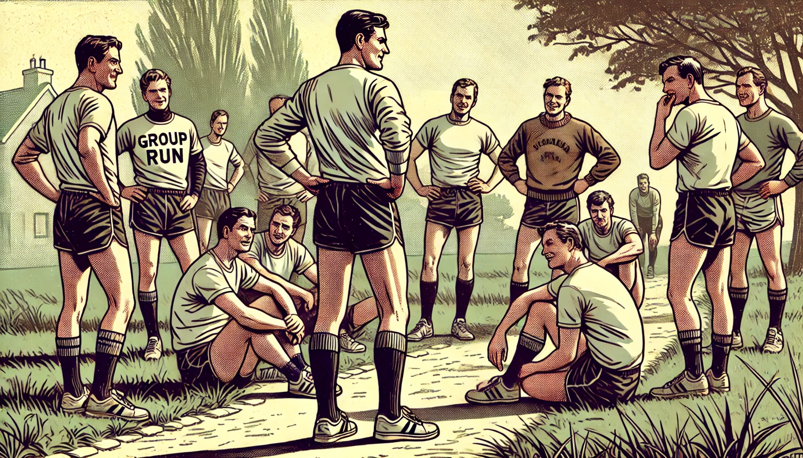

Every man has the potential to lead a life of meaning, confidence, and integrity. I help others discover and align their life's mission within 12 weeks without feeling lost or overwhelmed so that they can live a life filled with meaning and satisfaction.

After years in the tech industry, I realized that true success isn't just about professional achievements—it's about living a life aligned with one's values and purpose. Combining my analytical systems-minded background with a passion for personal growth, I established Momentum Institute to guide others on a unique 3-tier transformative experience.

**Highlights**

- Self-Study Programs: Flexible courses that allow you to explore at your own pace.
- One-on-One Coaching: Personalized guidance to address your unique challenges.
- Community Support: Join a network of like-minded individuals committed to growth.

Are you ready to build confidence and integrity? Let's start your journey together.

### Virtue Training

Virtue Training is a pet project of mine that results in weekly inspiration and actionable insights for strengthening personal virtues. My goal is to guide others through the exploration of timeless principles and values.

I believe that grounding oneself in core virtues is the key to a meaningful and fulfilling life. Each week, I explore a different virtue, offering reflections and practical steps to integrate these principles into everyday living.

**Highlights**

- Weekly Newsletters: Thought-provoking content delivered straight to your inbox.
- Actionable Insights: Practical exercises to apply each virtue in real life.
- Community Connection: Opportunities to engage with a community of like-minded individuals.

---

### IGNITION

IGNITION is the foundational program of the Momentum Institute, crafted to help men excavate and cultivate their personal code, principles, and boundaries. This program is the first of my guided transformative journey toward self-mastery and authentic living.

I believe that a life without a clear personal code is like a ship without a compass. Ignition is designed to help you discover your inner compass, ensuring you navigate life with confidence and meaning.

**Highlights**

- Deep Self-Reflection: Guided exercises to explore your values and beliefs.
- Personal Code Creation: Develop a set of principles that define who you are.
- Boundary Setting: Learn to establish healthy boundaries that honor your personal code.
- Expert Guidance: Benefit from the experience and insights of seasoned coaches.
- Supportive Environment: Join a community committed to growth and self-discovery.
- Lasting Impact: Equip yourself with tools and knowledge that will serve you for a lifetime.    

---

### SPRINT

SPRINT builds on the foundation of IGNITION to focus on setting and advancing meaningful goals through discipline and consistency. 

Achieving meaningful goals requires more than just intention—it demands action, discipline, and unwavering commitment. SPRINT is designed to instill these qualities, propelling you toward success.

**Highlights**

- **Effective Goal-Setting:** Techniques to define and prioritize your goals.
- **Discipline Enhancement:** Strategies to build and maintain disciplined habits.
- **Consistency Coaching:** Support to help you stay on track and overcome obstacles.
- **Proven Methods:** Learn from approaches that have helped many achieve their goals.
- **Personalized Guidance:** Tailored support to meet your unique needs.
- **Community Engagement:** Be part of a network that encourages and inspires.