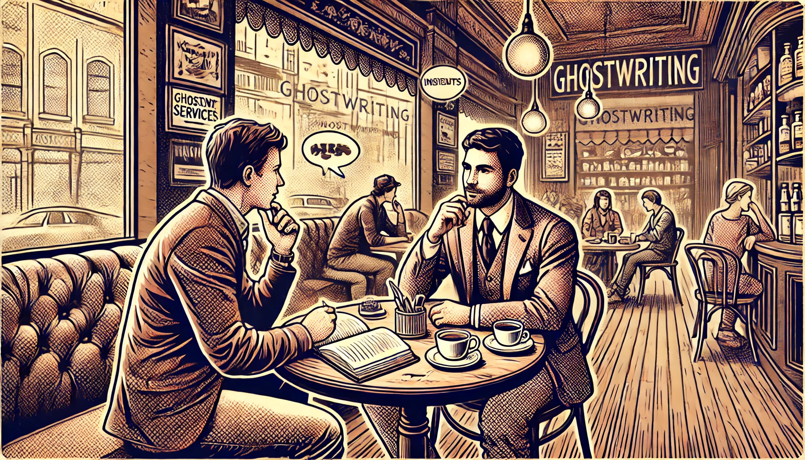

I believe that every coach and consultant has a unique voice and valuable expertise to share. However, conveying that value effectively can be challenging. I created the RED Method to help overcome this and other common hurdles to getting more clients online.

The program is split into simple stages. By working through these stages, coaches, consultants, and service providers gain practical skills and knowledge to attract more clients online and boost their business growth.

1. **Finding the Ideal Client**
   - *I help get a clear understanding of their ideal client without wasting time on unqualified leads so that they can focus their marketing efforts.*

2. **Defining the Value Offered**
   - *I help get clarity on their unique value without struggling to articulate their services so that they can communicate confidently.*

3. **Crafting Clear Messages**
   - *I help create compelling marketing messages without confusing their audience so that they can attract more clients.*

4. **Organizing Services**
   - *I help align services to be structured and organized without feeling overwhelming so that they are presented clearly.*

5. **Creating a Lead Magnet**
   - *I help create a valuable lead magnet without spending excessive time on content creation so that they can attract interested prospects.*

6. **Building a Sales Funnel**
   - *I help get an effective sales funnel set up without technical hassles so that they can convert prospects smoothly.*

7. **Developing a Natural Sales Approach**
   - *I help develop a natural sales approach without feeling pushy so that they can enroll clients confidently.*

8. **Content Strategy**
   - *I help create an engaging content strategy without spending hours on social media so that they can keep their audience engaged.*

9. **Reconnecting with Interested People**
   - *I help automate following up with potential clients without being spammy so that they can bring prospects back into the funnel.*

## Services

The RED Method is the heart of my consulting services. Below are unique offerings that leverage this framework to assist coaches, consultants, and service providers in growing their businesses.

### The Coaches Content Engine

The **Coaches Content Engine** is a platform designed to help coaches generate blogs, scripts, and other marketing content in their own voice and tone without sacrificing authenticity.

Creating consistent, authentic content often poses a time-consuming hurdle for coaches who may lack writing expertise.With the Coaches Content Engine, coaches are able to produce high-quality content that resonates with their audience, allowing them to focus more on their core coaching activities.

### Words That Work Wonders

For busy coaches seeking a more hands-on approach, **Words That Work Wonders** is a writing service dedicated to producing and promoting authentic content to grow their audience and generate leads for their coaching services.

Time constraints and writing challenges can hinder coaches from maintaining a strong online presence. By hiring my team, coaches can consistently engage their audience and attract more clients without the stress of content creation.

